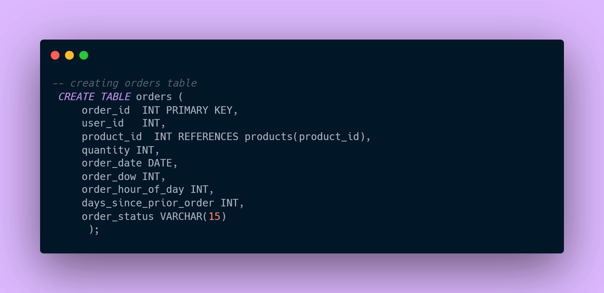
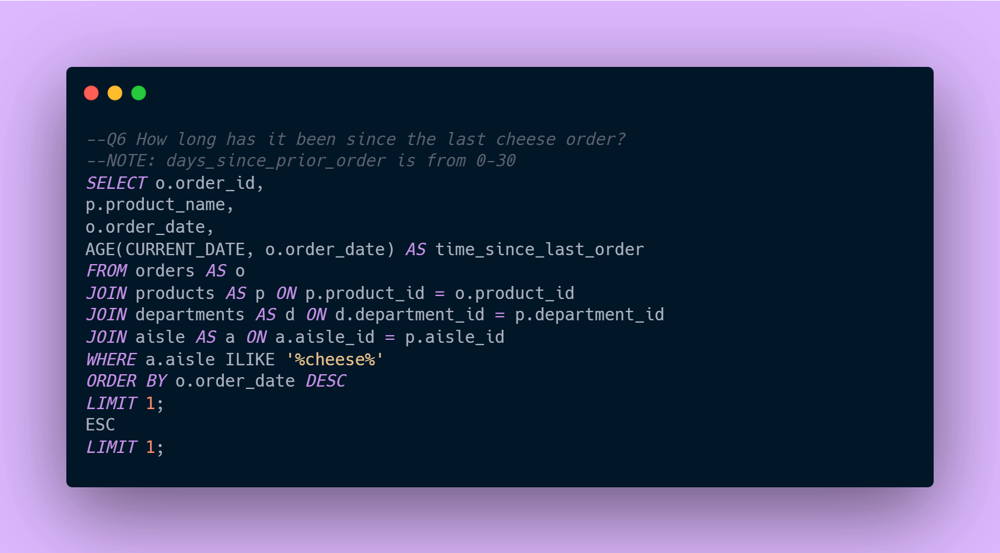
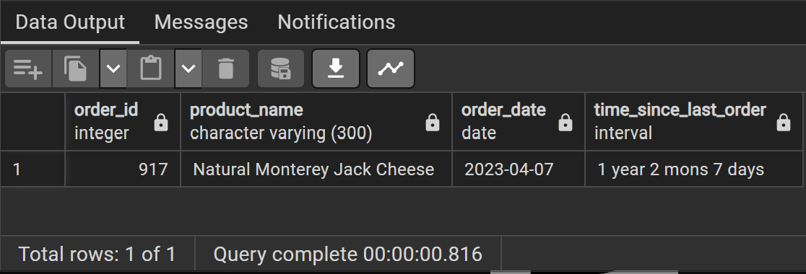
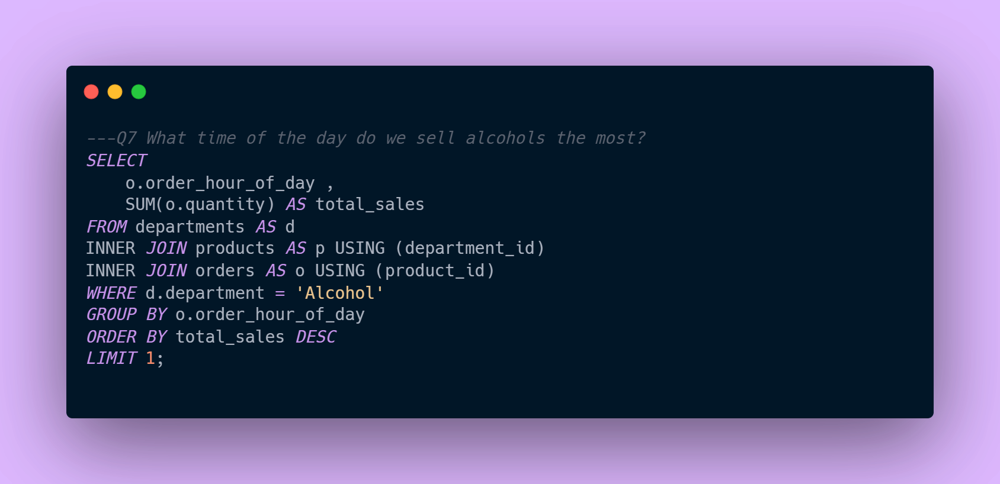

# InstaCart DB
## By Ifeoma Amadike
---

---
## INTRODUCTION 
---
Instacart, an American company, provides grocery delivery and pick-up services in the United States and Canada. Customers can access these services through a website and a mobile app, enabling them to order groceries from participating retailers. Personal shoppers then handle the shopping on behalf of the customers. This project specifically focuses on the denormalization of the Instacart orders dataset, along with some basic data analysis.

---
# SKILLS DEMONSTRATED
---
I used advanced SQL functions to import and normalize the dataset. Subsequently, I performed basic data analysis by querying the database, all within the PostgreSQL environment.

I created four(4) Tables which are 

---
### DEPARTMENTS TABLE

### RESULT

---
### AISLES TABLE 

### RESULT

---
### PRODUCTS TABLE

### RESULTS

---
### ORDERS TABLE

### RESULTS

---
## DATA MODELLING
The result of the table created  can be seen in this data model(STAR SCHEMA);
DATA MODEL

---
## DATA ANALYSIS & VISUALIZATIONS
I'll be using this database to solve the business problems that the owner of Instacart is interested in understanding and addressing.
### BUSINESS PROBLEMS

---
* Q1 What are the top-selling products by revenue, and how much revenue have they generated?
  ### QUERY
  
  RESULT

INSIGHT:::The top-selling product is the "Vanilla, Tangerine & Shortbread Ice Cream" with a total revenue of $20,496.00.

---
* Q2 On which day of the week are chocolates mostly sold?
### QUERY

### RESULT

INSIGHT::: The Day of the Week Chocolate sold mostly is Sunday , 8572 chocalates was sold.

---
* Q3 Do we have any dept where we have made over $15m in revenue and what is the profit?
  ### QUERY
  
  ### RESULT
  

  INSIGHT::: We have seven(7) different deparment that made over $15m in revenue ,the highest department was Personal care Department
  with $3917531 revenue

  ---

*Q4 Is it true that customers buy more alcoholic products on Xmas day 2019?
### QUERY

### RESULTS

INSIGHT:::  A Customer bought 14 Coastal Chardonnay Wine on the Xmas day 2019 

---
* Q5. Which year did Instacart generate the most profit?

### QUERY

### RESULTS

INSIGHT::: Instacart generate the most profit of $3619153 in 2020 

---
* Q6.  How long has it been since the last cheese order?

### QUERY

### RESULTS

INSIGHT:::  It has been 30 days since the last order

---
* Q7. What time of the day do we sell alcohols the most?

### QUERY

### RESULTS

INSIGHT:::  The time of the day we sell alcohol most is 10am with total sales of 19748

---
* Q8.  What is the total revenue generated in Qtr. 2 & 3 of 2016 from breads?

### QUERY

### RESULTS

INSIGHT:::  The time of the day we sell alcohol most is 10am with total sales of 19748

---

* Q9 Which 3  products do people buy at night(2020 - 2022)?

### QUERY

### RESULTS

INSIGHT:::  The 3 Products people buy at Night is Tangerine Immunity Defense Powder ,Ready Crust Shortbread 9 Inch Pie Crust and
Vegetable & Pepper Jack Cheese Flatbread Breakfast Sandwich.

---

* Q10. What is the total revenue generated from juice products?

### QUERY

### RESULTS

INSIGHT::: The total revenue generated from juice products is $5807518.00

---

## RECCOMMENDATIONS & CONCLUSIONS

---
### RECOMMENDATION

Based on the detailed sales and revenue data, several targeted strategies can be recommended to further enhance InstaCart's performance and profitability:

1. Promote Top-Selling Product:

* "Vanilla, Tangerine & Shortbread Ice Cream": As the top-selling product, this ice cream can be further promoted to maximize sales. InstaCart should consider offering special deals, discounts, and prominent placement on the website and app to attract more customers. Seasonal promotions and bundling it with complementary products can also drive higher sales.

2. Leverage High-Sales Days:

* Sunday Chocolate Sales: With 8,572 chocolates sold mostly on Sundays, InstaCart should capitalize on this trend by introducing Sunday-specific promotions or bundles. Marketing efforts such as email campaigns, push notifications, and social media posts can highlight these deals to boost sales further.

  
3. Focus on High-Revenue Departments:

* Personal Care Department: Generating the highest revenue of $3,917,531 among the seven departments that each made over $15 million, this department should be a focal point for targeted promotions. Strategies such as exclusive product launches, loyalty rewards, and personalized marketing can enhance customer engagement and increase sales.

  
4. Address Gaps in Product Orders:

* Cheese Orders: It has been 30 days since the last cheese order, indicating a potential issue or opportunity. InstaCart should investigate the reasons behind this gap and consider targeted promotions, reminders, or special offers to revive cheese sales.

   
5. Optimize High-Profit Periods:

* Alcohol Sales at 10 AM: With the highest alcohol sales occurring at 10 AM (19,748 sales), InstaCart should implement morning promotions or "Happy Hour" deals to further capitalize on this peak time. Highlighting popular alcohol brands and offering discounts during this time can drive additional sales.
  
6. Maximize Nighttime Purchases:
* Nighttime Popular Products: The products frequently bought at night – Tangerine Immunity Defense Powder, Ready Crust Shortbread 9 Inch Pie Crust, and Vegetable & Pepper Jack Cheese Flatbread Breakfast Sandwich – should be promoted with nighttime-specific discounts or bundle offers to encourage late-night shopping.
  
7. Seasonal and Holiday Promotions:
* Christmas Purchases: The sale of 14 Coastal Chardonnay Wines on Christmas Day 2019 suggests a significant opportunity for seasonal promotions. InstaCart should develop holiday-themed marketing 
 campaigns, special bundles, and gift sets to attract customers during festive seasons.

8. Boost Juice Product Sales:

* Juice Revenue: With total revenue from juice products reaching $5,807,518, targeted marketing campaigns can be designed to further promote these products. Offering health tips, recipes, and juice bundles can appeal to health-conscious consumers and drive higher sales.

  
### CONCLUSION
InstaCart's comprehensive sales and revenue data reveal multiple opportunities for growth and increased profitability. By focusing on promoting the top-selling "Vanilla, Tangerine & Shortbread Ice Cream," leveraging high-sales days and peak times, and enhancing marketing efforts for high-revenue departments, InstaCart can drive higher sales and customer engagement. Addressing gaps in product orders and capitalizing on nighttime and seasonal purchase trends will further strengthen InstaCart's market position. Implementing these recommendations will ensure sustained growth, maximize profitability, and enhance customer satisfaction for InstaCart.
